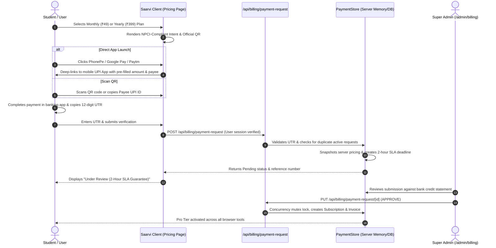

# Saarvi Manual UPI Payment System — Architecture & Operations Guide

## Executive Summary
Saarvi implements an authoritative, secure, and user-friendly **Manual UPI Payment Engine** designed specifically for Indian students and professionals. The system allows users to upgrade to **Saarvi Pro** via direct UPI application launch (**PhonePe**, **Google Pay**, **Paytm**, **BHIM**, or any UPI client) or via **Scan-to-Pay QR Code**, followed by submission of their 12-digit UTR (Unique Transaction Reference) number.

All payments are bound by a **2-Hour Review SLA** tracked in real time. Pro entitlements are activated strictly server-side by authenticated Super Admins, preventing unauthorized activation, tampering, or billing bleed.

---

## 1. End-to-End Payment Flow

---

## 2. Technical Specifications

### 2.1 NPCI-Compliant UPI Deep-Linking
Direct application intents are generated according to the official National Payments Corporation of India (NPCI) specification:

| Parameter | Key | Value / Source | Description |
|---|---|---|---|
| Payee VPA | `pa` | Server Config (`saarvi@upi`) | Virtual Payment Address of Saarvi account |
| Payee Name | `pn` | Server Config (`Saarvi`) | Recipient legal display name |
| Amount | `am` | Server Config (`49.00` / `399.00`) | Exact transactional amount in INR |
| Currency | `cu` | `INR` | Indian Rupee currency standard |
| Transaction Note | `tn` | `SAARVI-UPI-XXXXXX` | Server-assigned unique transaction reference |

### 2.2 Deep-Link URI Schemes
- **Universal UPI**: `upi://pay?pa=...&pn=...&am=...&cu=INR&tn=...`
- **PhonePe Direct**: `phonepe://pay?pa=...&pn=...&am=...&cu=INR&tn=...`
- **Google Pay Direct**: `gpay://upi/pay?pa=...&pn=...&am=...&cu=INR&tn=...`
- **Paytm Direct**: `paytmmp://pay?pa=...&pn=...&am=...&cu=INR&tn=...`

---

## 3. Server-Authoritative Controls & Tampering Defense
1. **Zero Client Price Authority**: Clients cannot send prices or discounts in requests. The server strictly queries `PaymentStore.getConfig()` to compute the exact price based on `planDuration`.
2. **Duplicate Active Protection**: Users cannot create multiple concurrent pending requests. Existing active requests must be approved or rejected before a new one can be logged.
3. **Concurrency Mutex Locking**: Multi-admin simultaneous approvals are serialized via mutex key `lock:approval:{requestId}`. If two admins approve at the same millisecond, exactly one succeeds and the other is safely prevented from double-activating entitlements.
4. **Audit Trail**: Every request creation, configuration update, approval, and rejection is permanently recorded in `AuditLogRecord` with admin email, timestamp, and metadata.

---

## 4. 2-Hour Review SLA Tracking
Every payment request receives an authoritative `slaDeadline` set to `Date.now() + (reviewSlaHours * 60 * 60 * 1000)`.
- **In Dashboard (`/dashboard/billing`)**: Students see an active timer: `"Review SLA: ~XX mins remaining"`.
- **In Admin Portal (`/admin/billing`)**: Admins receive visual badges (`Under Review` vs `Overdue by XX mins`). An overdue counter highlights submissions requiring immediate operator clearance.
- **Critical Invariant**: SLA expiry **never** auto-approves a request. Approval strictly requires manual human admin confirmation against verified bank credits.
