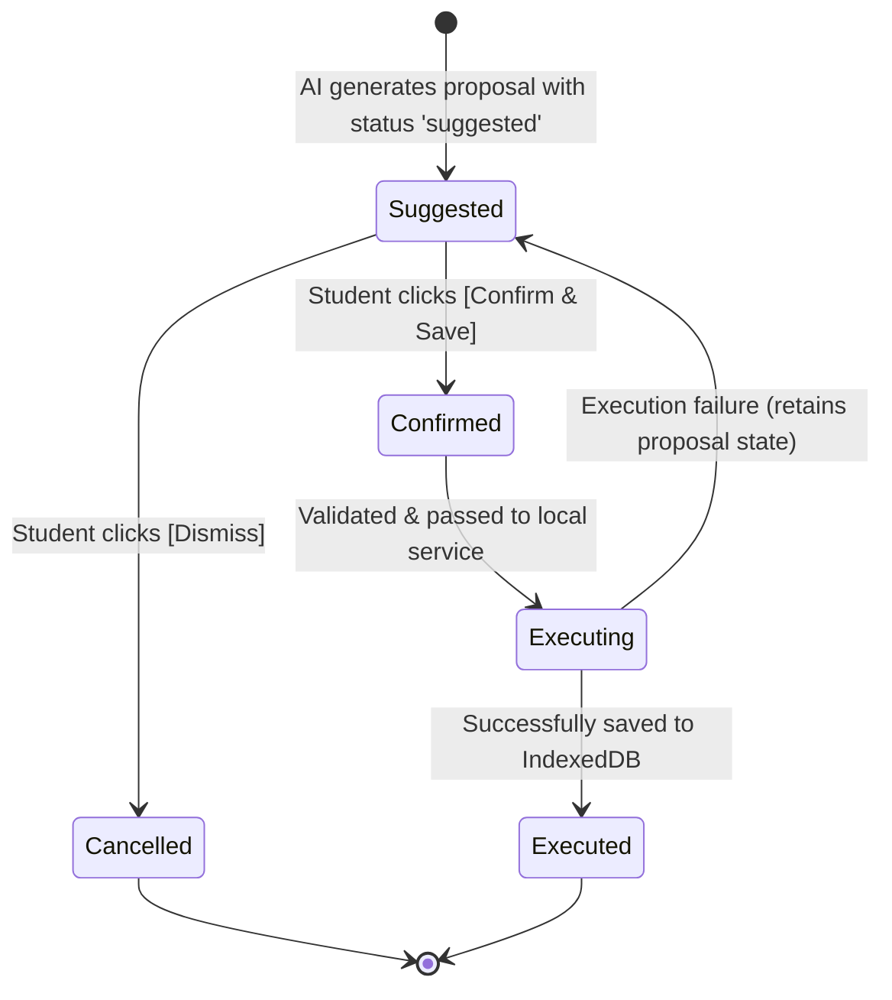

# DocEase Copilot Action System & Execution Safeguards

## 1. Safety Invariant

> **AI CANNOT DIRECTLY MUTATE USER DATA.**
> All state-changing recommendations made by DocEase Copilot are structured proposals. They are rendered in the UI as interactive Action Preview Cards. No record is written to IndexedDB until the student clicks **[Confirm & Save]**.

---

## 2. Action Lifecycle



---

## 3. Supported Action Schemas

### 3.1 `create_study_session`
Schedules a focused study block in the student's study planner.

- **Type**: `"create_study_session"`
- **Payload Schema**:
  ```json
  {
    "subject": "Database Management Systems",
    "date": "2026-09-13",
    "startTime": "18:00",
    "durationMinutes": 60,
    "priority": "high",
    "notes": "Review Normalization and ER Diagrams"
  }
  ```
- **Validation Rules**:
  - `subject`: Non-empty string.
  - `date`: Valid `YYYY-MM-DD` formatted date.
  - `startTime`: Valid `HH:mm` 24-hour time format.
  - `durationMinutes`: Number between 1 and 480 minutes.
- **Conflict Detection**:
  - Automatically queries `studentService.getStudySessions()` to detect overlapping intervals on the scheduled date.
- **Execution Target**: `studentService.saveStudyPlan()` -> writes to `academicStorage.saveStudySession()`.

---

### 3.2 `create_task`
Adds an actionable task or homework reminder to the student's task workspace.

- **Type**: `"create_task"`
- **Payload Schema**:
  ```json
  {
    "title": "Complete Module 3 Assignment",
    "priority": "HIGH",
    "dueDate": "2026-09-15",
    "description": "SQL Join exercises and schema normalization",
    "category": "Copilot"
  }
  ```
- **Validation Rules**:
  - `title`: Non-empty string.
  - `priority`: Normalized to `"LOW" | "MEDIUM" | "HIGH"`.
- **Execution Target**: `studentService.saveTask()` -> writes to `academicStorage.saveTask()`.

---

### 3.3 `schedule_reminder`
Schedules a multi-channel reminder using the Phase 19 Smart Notification Engine.

- **Type**: `"schedule_reminder"`
- **Payload Schema**:
  ```json
  {
    "eventTitle": "DBMS CIE-2 Examination",
    "date": "2026-09-18",
    "scheduledTime": "09:30",
    "eventType": "exam",
    "reminderTiming": "1_day_before",
    "whatsapp": false
  }
  ```
- **Validation Rules**:
  - `eventTitle`: Non-empty string.
  - `date`: Valid `YYYY-MM-DD` date.
- **Execution Target**: `notificationService.scheduleReminder()`.

---

### 3.4 `navigate_to_feature`
Provides an in-app shortcut to a relevant DocEase feature.

- **Type**: `"navigate_to_feature"`
- **Payload Schema**:
  ```json
  {
    "route": "/student/calculator"
  }
  ```
- **Validation Rules**:
  - `route`: Valid internal route starting with `"/"`.
- **Execution Target**: `router.push(route)`.

---

## 4. Execution Dispatcher Architecture

```typescript
export async function executeAction(
  action: CopilotAction,
  profileId: string = "guest"
): Promise<{ success: boolean; message: string }> {
  // STRICT SAFETY CHECK: User confirmation required
  if (action.status !== "confirmed") {
    return {
      success: false,
      message: "Action rejected: user confirmation is strictly required before mutating workspace data.",
    };
  }

  const validation = validateAction(action);
  if (!validation.valid) {
    return { success: false, message: validation.error };
  }

  // Dispatch to verified local service
  ...
}
```
