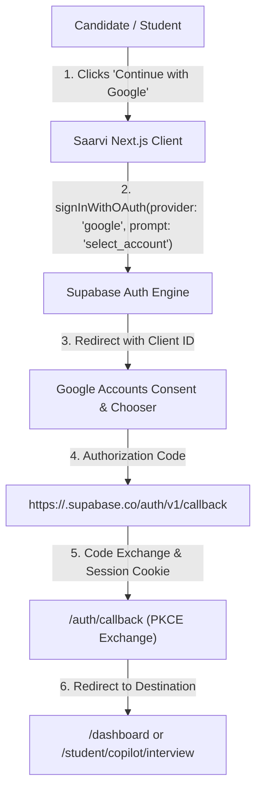

# Saarvi — Google OAuth Branding & Production Integration Guide

This guide details the complete configuration required to identify the application as **Saarvi — Study. Work. Grow.** during the Google OAuth login and consent flow while using **Supabase Auth** as the secure authentication backend.

---

## Architecture Separation of Concerns



Three distinct configuration layers are involved:
1. **Application Code (In-Repository)**: Handled directly in this Next.js codebase.
2. **Google Cloud Console (External)**: Configures the Google Auth Platform branding, app name, logo, domain verification, and OAuth credentials.
3. **Supabase Dashboard (External)**: Stores Google Client ID & Secret and handles server-side token exchange.

---

## 1. Application Code (Implemented in Saarvi)

### A. Dynamic Origin & Callback URL Resolution
Application code does not hardcode an unowned domain. It resolves the origin dynamically from `window.location.origin` or `process.env.NEXT_PUBLIC_SITE_URL`:

```ts
// src/context/AuthContext.tsx
const origin = typeof window !== 'undefined' 
  ? window.location.origin 
  : (process.env.NEXT_PUBLIC_SITE_URL || 'https://saarvi.in');

const sanitizedNext = sanitizeInternalRedirectUrl(options?.redirectTo, '/dashboard');
const callbackUrl = `${origin}/auth/callback?next=${encodeURIComponent(sanitizedNext)}`;
```

### B. Account Selector (`prompt: "select_account"`)
To allow users with multiple personal or university Google accounts to pick the correct account without getting stuck in automatic loops:

```ts
const { error } = await supabase.auth.signInWithOAuth({
  provider: 'google',
  options: {
    redirectTo: callbackUrl,
    queryParams: {
      prompt: 'select_account',
    },
  },
});
```

### C. Safe Callback & Open-Redirect Protection
In `src/app/auth/callback/route.ts`, destinations are strictly sanitized with `sanitizeInternalRedirectUrl()`, and forwarded hosts are validated against verified Saarvi hosts and Vercel environments.

### D. UI Standards
The Google Sign-In button (`src/components/auth/GoogleSignInButton.tsx`):
- Uses standard 4-color Google vector logo without distortion.
- Provides accessible minimum 44px touch target.
- Implements duplicate-click prevention and loading spinners.
- Handles user-facing errors gracefully without exposing secrets or stack traces.

---

## 2. Google Cloud Platform Branding Configuration

To ensure Google's consent screen displays **Saarvi** and our brand identity instead of an unbranded identifier or raw domain:

### Step 1: Open Google Auth Platform
1. Log in to [Google Cloud Console](https://console.cloud.google.com/).
2. Select or create your project (e.g., `saarvi-production`).
3. Navigate to **APIs & Services** → **OAuth consent screen** (or **Google Auth Platform** → **Branding**).

### Step 2: Configure Application Details
Configure the following branded metadata:

| Field | Recommended Value | Notes |
|---|---|---|
| **App Name** | `Saarvi` | Displayed prominently at top of chooser |
| **User Support Email** | `support@saarvi.app` (or verified admin Google account) | Must be an address you can receive mail on |
| **App Logo** | Upload official logo from `/public/brand/saarvi-logo.png` | 120x120px to 500x500px, PNG or JPG, < 1MB |
| **Application Home Page** | `https://saarvi.app` (or your current production Vercel URL) | Must match an authorized domain |
| **Privacy Policy URL** | `https://saarvi.app/privacy` | Live, public privacy policy |
| **Terms of Service URL** | `https://saarvi.app/terms` | Live, public terms of service |
| **Developer Contact Information** | `admin@saarvi.app` | Required by Google for policy updates |

### Step 3: Configure Authorized Domains
Under **Authorized domains**, add:
- `saarvi.app` (when live)
- `saarvi.in`
- `supabase.co` (essential for Supabase Auth redirect handling)
- `vercel.app` (if utilizing Vercel preview environments)

### Step 4: OAuth 2.0 Client ID Configuration
Navigate to **APIs & Services** → **Credentials** → **OAuth 2.0 Client IDs**:
1. Click **Create Credentials** → **OAuth client ID** → Application type: **Web application**.
2. **Name**: `Saarvi Web Client`.
3. **Authorized JavaScript origins**:
   - `http://localhost:3000` (for local development)
   - `https://saarvi.app`
   - `https://www.saarvi.app`
   - `https://<your-vercel-deployment>.vercel.app`
4. **Authorized redirect URIs**:
   - `https://<your-supabase-ref>.supabase.co/auth/v1/callback`
   *(Important: Do NOT add localhost here; Google redirects to Supabase first, and Supabase redirects back to Saarvi).*
5. Copy the generated **Client ID** and **Client Secret**.

---

## 3. Supabase Dashboard Configuration

### Step 1: Enable Google Provider
1. Open your [Supabase Dashboard](https://supabase.com/dashboard/project/_/auth/providers).
2. Go to **Authentication** → **Providers** → **Google**.
3. Toggle **Enable Sign in with Google** to ON.
4. Enter:
   - **Client ID**: Paste from Google Cloud Console.
   - **Client Secret**: Paste from Google Cloud Console.
5. Click **Save**.

### Step 2: Configure Redirect URLs in Supabase
In Supabase Dashboard → **Authentication** → **URL Configuration**:
1. **Site URL**: `https://saarvi.app` (or your production Vercel URL, e.g. `https://smart-doc-platform.vercel.app`).
2. **Redirect URLs** (allow-list):
   - `http://localhost:3000/auth/callback`
   - `http://localhost:3000/**`
   - `https://saarvi.app/auth/callback`
   - `https://www.saarvi.app/auth/callback`
   - `https://*.vercel.app/auth/callback`

---

## 4. Verification & Publishing Checklist

Before going live to public users without the Google "unverified app" warning:
- [ ] Submit the OAuth Consent Screen for Google Verification under **Publishing Status** (select **In Production**).
- [ ] Ensure `privacy` and `terms` pages are publicly accessible without authentication.
- [ ] Verify ownership of the root domain via Google Search Console.
- [ ] Test the login flow on both Desktop and Mobile browsers.
